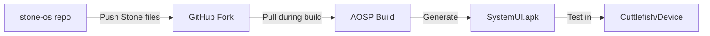

# StoneOS Development Structure

## Repository Organization

This repository contains all StoneOS development resources, organized for clarity and maintainability.

### Directory Structure

```
stone-os/                           # Main StoneOS repository
├── builds/                         # Build outputs
│   └── latest/                     # Most recent build artifacts
│       └── StoneOS_SystemUI_*.apk  # Built SystemUI with Stone components
│
├── stone/                          # Stone SystemUI components (source of truth)
│   ├── StonePanel.java            # 1/3 screen chat interface
│   └── StoneIcon.java             # Always-visible Stone icon
│
├── stone-agent/                    # LiveKit-based AI agents
│   ├── package.json               # TypeScript agent configuration
│   └── src/                       # Agent implementations
│
├── mcp-servers/                    # Model Context Protocol servers
│   ├── spotify-mcp/               # Spotify control
│   ├── maps-mcp/                  # Google Maps integration
│   ├── telephony-mcp/             # Phone/SMS control
│   ├── calendar-mcp/              # Calendar management
│   └── notion-mcp/                # Notion integration
│
├── stone-launcher/                 # React Native launcher (future)
│   └── (React Native app structure)
│
├── scripts/                        # Build and deployment scripts
│   ├── build_stoneos.sh          # Main GCP build script
│   └── test_emulator.sh          # Local emulator testing
│
├── docs/                          # Documentation
│   ├── STONEOS_SPECS.md         # Complete feature specifications
│   ├── CLAUDE.md                 # AI assistant instructions
│   └── README.md                 # Project overview
│
└── integration/                   # Integration configurations
    └── (MCP configurations)
```

## Development Workflow

### 1. Core Development Flow



### 2. Key Repositories

- **This Repo** (`stone-os`): Central development hub with all Stone code
- **Fork** (`stoneos-frameworks`): Forked AOSP frameworks/base with Stone integration
- **AOSP** (`~/aosp`): Full Android source tree (150GB, not in git)

### 3. Making Changes

#### To modify Stone components:
1. Edit files in `stone/` directory
2. Push to this repository
3. Copy to fork and push there
4. Rebuild AOSP

#### To add new features:
1. Develop in appropriate directory (agent, mcp-server, etc.)
2. Test locally
3. Integrate with Stone components if needed
4. Document in specs

### 4. Build Process

```bash
# On GCP instance
cd ~/aosp
source build/envsetup.sh
lunch aosp_x86_64-ap2a-eng
m SystemUI -j16

# Output location
out/target/product/generic_x86_64/system/system_ext/priv-app/SystemUI/SystemUI.apk
```

## Testing

### Cuttlefish (Virtual Device)
- Full Android system emulation
- Accessible via web browser
- Tests system-level changes

### Physical Device (Pixel 8a)
- Requires unlocked bootloader
- Use Magisk for root access
- Real-world performance testing

## Fork Management

The `stoneos-frameworks` fork contains:
- Branch: `android-14.0.0_r61`
- Stone files in: `packages/SystemUI/src/com/android/systemui/stone/`
- Modified `Android.bp` for build integration

### Syncing Fork with Changes
```bash
# From this repo
cp stone/*.java ~/stoneos-fork-setup/stoneos-frameworks/packages/SystemUI/src/com/android/systemui/stone/
cd ~/stoneos-fork-setup/stoneos-frameworks
git add -A
git commit -m "Update Stone components"
git push origin android-14.0.0_r61
```

## Environment Locations

- **Main Dev Repo**: `~/stone-os` (this repository)
- **AOSP Source**: `~/aosp` (150GB, not tracked)
- **Fork Management**: `~/stoneos-fork-setup/stoneos-frameworks`
- **Build Output**: `~/aosp/out/`

## Key Files

### Stone Components
- `StonePanel.java`: Handles the sliding chat interface
- `StoneIcon.java`: Manages the always-visible Stone icon

### Build Configuration
- Fork's `Android.bp`: Includes Stone files in SystemUI build
- Local manifest: Tells AOSP to use our fork

### Scripts
- `build_stoneos.sh`: Automated GCP build process
- `test_emulator.sh`: Local testing setup

## Next Steps

1. **Cuttlefish Setup**: Virtual device for testing
2. **CI/CD Pipeline**: Automated builds from fork
3. **Stone Launcher**: Replace default Android launcher
4. **Agent Integration**: Connect LiveKit agents to SystemUI